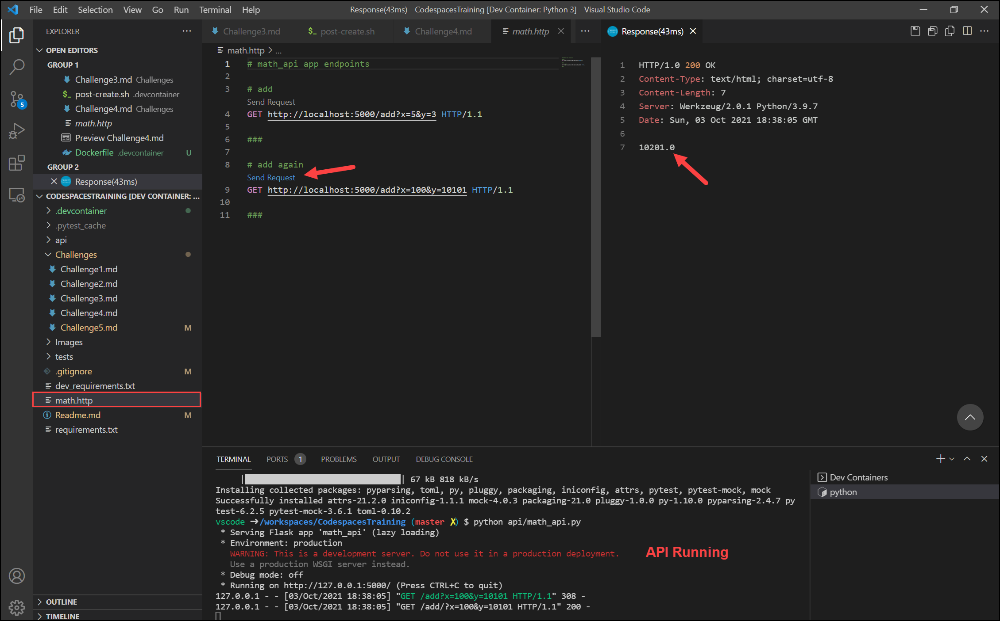

## Extensions
As noted in Readme.md, the goal of these technologies is to allow developers to define a fully-configured development environment.  Fully-configured goes well beyond just defining a container with all of the application dependencies that the developer can develop in.  Developer containers also have a Visual Studio Code Server running in them and this server can also be configured by the devcontainer.json file.

One of the options is to configure the extensions that are installed in the code server running in the developer container.  The "in the developer container" part of that sentence is important.  [The following hold true for extensions configured in devcontainer.json](https://code.visualstudio.com/docs/remote/containers#_managing-extensions):
- Some extensions have to run locally, including themes and snippets
- Extensions that can be run on the server are **not** installed on your local Visual Studio Code Client.  They **will be** installed in the Visual Studio Code Server running in the developer container.

Beyond the devcontainer.json, it is possible to install extensions that are installed locally in Visual Studio Code in the remote container.  This can be done via the Extensions tab.

### Rest Client - a helpful extension
There is an extension that is very helpful when developing REST APIs.  It is the [Rest Client](https://marketplace.visualstudio.com/items?itemName=humao).  Among other things, it allows you to send HTTP requests from a file (*.http) and see the results in a separate panel.  See the example below:

## Challenge
Install the [Rest Client extension](https://marketplace.visualstudio.com/items?itemName=humao.rest-client) in the developer container and make a call to the add operation.

## Helpful Hints
Make sure the API is running.